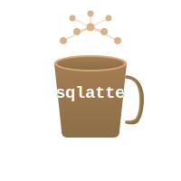

# SQLatte ☕

<p align="center">
  
</p>

<p align="center">
  <strong>AI-Powered Natural Language to SQL Converter</strong><br>
  Transform your questions into SQL queries with the power of AI
</p>

<p align="center">
  
  
  
</p>

---

## 🌟 Features

- 🤖 **AI-Powered** - Uses Anthropic Claude for intelligent query generation
- 🗄️ **Multi-Database Support** - Trino, Presto, PostgreSQL, MySQL, and more
- 💬 **Smart Chat Interface** - Conversational AI that understands context
- 🔗 **Multi-Table JOINs** - Automatically detects and creates table relationships
- 📱 **Widget-Based UI** - Fullscreen modal with modern, responsive design
- ⚡ **Fast & Simple** - Single YAML config file, no complex setup
- 🐳 **Docker Ready** - Easy deployment with Docker & Docker Compose

---

## 🚀 Quick Start

### 1. Installation

```bash
# Clone the repository
git clone https://github.com/osmanuygar/sqlatte.git
cd sqlatte

# Install dependencies
pip install -r requirements.txt
```

### 2. Configuration

Edit `config/config.yaml` with your credentials:

```yaml
# LLM Configuration
llm:
  provider: "anthropic"
  anthropic:
    api_key: "sk-ant-your-key-here"  # Add your Anthropic API key
    model: "claude-sonnet-4-20250514"

# Database Configuration
database:
  provider: "trino"
  trino:
    host: "your-trino-host.com"
    port: 443
    user: "your-username"
    password: "your-password"
    catalog: "hive"
    schema: "default"
```

### 3. Run

```bash
# Start the server
python run.py

# Open in browser
http://localhost:8000
```

**That's it!** 🎉

---

---

## 🎨 Architecture

### Backend Flow

```
User Question
     ↓
LLM Intent Detection (SQL or Chat?)
     ↓
   ┌─────────────┬──────────────┐
   │             │              │
  SQL          Chat         Schema
   │             │              │
Generate      Generate      Fetch from DB
 Query       Response
   │             │
Execute       Return
   │             │
   └──────┬──────┘
          ↓
    Return Results
```

---

## 🐳 Docker Deployment

### Using Docker Compose (Recommended)

```bash
# 1. Edit config/config.yaml and set your credentials
vi config/config.yaml

# 2. Start with Docker Compose
docker-compose up -d

# 3. Open browser
http://localhost:8000
```

### Using Dockerfile

```bash
# Build image
docker build -t sqlatte .

# Run container
docker run -d -p 8000:8000 \
  -e ANTHROPIC_API_KEY="your-key" \
  -e TRINO_HOST="your-host" \
  --name sqlatte \
  sqlatte
```
---

## 🔌 Embedding in Your Website

You can easily add the SQLatte widget to **any existing website**. There are two ways to deploy:

### 📡 Method 1: Serve from SQLatte Backend (Recommended)

**Easiest way!** SQLatte backend already serves the widget files. Just point to your backend:

```html
<!-- Load widget directly from SQLatte backend -->
<script src="http://YOUR-SQLATTE-SERVER:8000/static/js/sqlatte-badge.js"></script>
```

**That's it!** The badge will appear in the bottom-right corner.

#### Complete Example

```html
<!DOCTYPE html>
<html lang="en">
<head>
    <meta charset="UTF-8">
    <title>My Website with SQLatte</title>
</head>
<body>
    <h1>My Awesome Website</h1>
    <p>Your content here...</p>

    <!-- Load widget from SQLatte backend -->
    <script src="http://192.168.1.100:8000/static/js/sqlatte-badge.js"></script>
    
    <!-- Configure (optional) -->
    <script>
        window.addEventListener('load', () => {
            window.SQLatteWidget.configure({
                fullscreen: true,
                apiBase: 'http://192.168.1.100:8000'  // Same as script source
            });
        });
    </script>
</body>
</html>
```


#### CORS Configuration

If your website and SQLatte are on **different domains**, configure CORS:

**Edit `config/config.yaml`:**
```yaml
cors:
  allow_origins: 
    - "https://your-website.com"      # Your website domain
    - "http://192.168.1.50"           # Or internal IP
  allow_credentials: true
  allow_methods: ["*"]
  allow_headers: ["*"]
```

**Restart SQLatte backend:**
```bash
# Restart to apply CORS changes
python run.py
# or
docker-compose restart
```

---

### ⚙️ Configuration Options

Customize the widget behavior:

```javascript
window.SQLatteWidget.configure({
    // Position of the badge button
    position: 'bottom-right',  // 'bottom-right', 'bottom-left', 'top-right', 'top-left'
    
    // Open modal in fullscreen
    fullscreen: true,          // true = fullscreen, false = floating modal
    
    // Modal title
    title: 'SQLatte Assistant ☕',
    
    // Input placeholder text
    placeholder: 'Ask a question...',
    
    // API base URL (SQLatte backend)
    apiBase: 'http://your-backend:8000',
    
    // Delay before showing badge (milliseconds)
    autoShowDelay: 1000,
    
    // Open widget automatically on page load
    openByDefault: false
});
```

### Programmatic Control

You can control the widget with JavaScript:

```javascript
// Open the widget
window.SQLatteWidget.open();

// Close the widget
window.SQLatteWidget.close();

// Toggle widget
window.SQLatteWidget.toggle();

// Get current configuration
const config = window.SQLatteWidget.getConfig();
console.log(config);
```

### Integration with Buttons

Add custom buttons to open the widget:

```html
<button onclick="window.SQLatteWidget.open()">
    💬 Ask AI Assistant
</button>

<button onclick="window.SQLatteWidget.toggle()">
    🔍 Query Database
</button>
```

---

<p align="center">
  <strong>Made with ❤️ and ☕</strong><br>
  <sub>Transform your data queries with the power of AI</sub>
</p>

---
