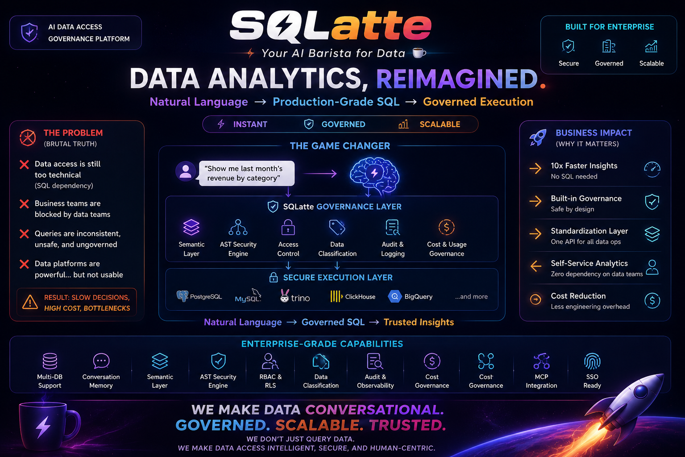

# SQLatte ☕

<p align="center">
  
</p>

<p align="center">
  <strong>The Governed Data Layer for AI Agents and Analysts</strong><br>
  Every query — human or AI-generated — passes through the same access controls, validation, and audit pipeline.
</p>

<p align="center">
  
  
  
  
  
</p>

<p align="center">
    
</p>

---

## What is SQLatte?

Most teams give AI assistants raw database credentials. SQLatte sits in between: short-lived tokens, schema-scoped access, full audit trail, one-click revocation. Analysts get a chat interface; AI agents get MCP tools. Both go through the same validation and audit pipeline.

**The core guarantee:** whether a query is typed by a human or generated by an AI agent, it goes through the same intent detection → SQL generation → validation → audit trail. There is no separate, unaudited path for AI agents.

---

## Who is This For?

- **Data teams** running Trino, BigQuery, or Postgres who want analysts asking questions in plain English instead of filing SQL tickets
- **Platform and security teams** who need governed, audited AI agent access to the data warehouse without distributing raw credentials
- **SaaS builders** embedding a conversational data interface into their product via the embeddable widget or multi-tenant auth plugin

---

## Architecture

```
┌─────────────────────────────────────────────────────────────┐
│                     Frontend Layer                          │
│  • Chat Interface  • Admin Panel  • Embeddable Widgets     │
└────────────────────┬────────────────────────────────────────┘
                     │
┌────────────────────▼────────────────────────────────────────┐
│                   API Layer (FastAPI)                       │
│  • Query Routes  • Admin Routes  • Analytics  • Scheduler  │
└────────────────────┬────────────────────────────────────────┘
                     │
┌────────────────────▼────────────────────────────────────────┐
│              Core Processing Layer                          │
│  • Intent Detection  • SQL Generation  • Query Execution   │
│  • Insights Engine  • Dashboard Generator                   │
└────────────────────┬────────────────────────────────────────┘
                     │
┌────────────────────▼────────────────────────────────────────┐
│         Database Provider Factory                           │
│  (Trino │ PostgreSQL │ MySQL │ BigQuery)                   │
└─────────────────────────────────────────────────────────────┘
```

Every request — whether from the chat UI, an embedded widget, or an MCP client — executes through the same pipeline. There is no separate path for AI agents.

---

## 🔌 MCP Server — AI Agent Gateway

SQLatte is a native MCP server. Any MCP-compatible client — Claude Desktop, Claude Code, or a custom agent — gets controlled, audited access to your data warehouse without holding raw credentials.

- **Short-lived tokens** tied to specific catalogs and schemas
- **Every generated query validated** before execution
- **Every call logged** with token counts and source (UI / widget / MCP)
- **One-click revocation** — no credential rotation needed

```bash
pip install mcp httpx
```

### Network Mode — SSE (No local Python required)

Enable in `config.yaml` to serve MCP over HTTP. Users connect with just a URL — no local script or Python installation needed.

```yaml
mcp:
  sse:
    enabled: true
```

```json
{
  "mcpServers": {
    "sqlatte": {
      "url": "http://your-sqlatte-server:8000/mcp/sse",
      "headers": { "x-mcp-token": "<token>" }
    }
  }
}
```

**Claude Desktop** doesn't speak HTTP/SSE directly — bridge it with [`mcp-remote`](https://www.npmjs.com/package/mcp-remote):

```json
{
  "mcpServers": {
    "sqlatte": {
      "command": "npx",
      "args": [
        "mcp-remote@latest",
        "http://your-sqlatte-server:8000/mcp/sse",
        "--header",
        "x-mcp-token: <token>",
        "--allow-http"
      ]
    }
  }
}
```

`--allow-http` is only needed for plain HTTP endpoints — drop it once the server is behind TLS.

Multiple users connect to the same server concurrently — each connection is isolated by token.

### Local Mode — stdio (Default)

### Option A — API Token (Recommended)

Keeps real database credentials out of MCP config. Generate a token from the SQLatte UI; it stores the connection details server-side.

**1. Generate a token:**

Login to SQLatte → open the chat widget → click **🔑 API Tokens** → Generate.
Copy the token (shown only once).

**2. Add to Claude config:**

```json
{
  "mcpServers": {
    "sqlatte": {
      "command": "python3",
      "args": ["/path/to/sqlatte/sqlatte_mcp_server.py"],
      "env": {
        "SQLATTE_URL": "http://localhost:8000",
        "SQLATTE_TOKEN": "<token>"
      }
    }
  }
}
```

Token TTL is configurable (24h default). Each user generates their own token — the token carries their catalog/schema context.

### Option B — Username / Password (Legacy)

```json
{
  "mcpServers": {
    "sqlatte": {
      "command": "python3",
      "args": ["/path/to/sqlatte/sqlatte_mcp_server.py"],
      "env": {
        "SQLATTE_URL": "http://localhost:8000",
        "TRINO_HOST": "your-trino-host",
        "TRINO_PORT": "443",
        "TRINO_USER": "your-username",
        "TRINO_PASSWORD": "your-password",
        "TRINO_CATALOG": "hive",
        "TRINO_SCHEMA": "default",
        "TRINO_HTTP_SCHEME": "https"
      }
    }
  }
}
```

Available tools: **`ask_database`** (natural language → SQL → results), **`list_tables`**, **`get_schema`**, and **`discover_tables`** (Trino only, cross-catalog table search — opt-in via `plugins.auth.enable_discovery_tokens: true`, off by default).

### Field Masking

Sensitive columns can be masked before results reach the AI agent. Rules are managed in the Admin Panel under **MCP Masking** — no code or restart required. Three strategies:

| Strategy | Example output |
|---|---|
| `hash` | `a3f8bc2d1e4f9a07` (SHA-256, 16-char — groupable) |
| `partial` | `j**@company.com` |
| `redact` | `[REDACTED]` |

Field patterns support wildcards (`*email*`, `*_phone`). Rules can be toggled on/off individually.

---

## 🚀 Features

### Core Analytics

- **Task-Based LLM Routing** — Different models for different tasks (intent detection, SQL generation, insights) to balance cost and accuracy
- **Conversation Memory** — Context-aware follow-up questions
- **Multi-Table JOINs** — Automatic relationship detection
- **Query History & Favorites** — Save and replay queries
- **SQL Syntax Highlighting** — Code display with copy functionality
- **CSV Export** — Export results to spreadsheet format

### Semantic Layer

Transform raw table names into business-friendly metadata that improves AI SQL accuracy:

- **Business-Friendly Names** — "Customer Master" instead of `cust_tbl_v2`
- **Automatic JOINs** — Define relationships once; the AI uses them automatically
- **Calculated Metrics** — Centralized business logic so every query uses the same definition of "revenue"
- **Auto-Discovery** — Scan database and get instant entity suggestions
- **Visual Admin UI** — Browser-based entity, relationship, and metric builder
- **Enhanced AI Context** — Richer metadata produces more accurate SQL

### Dashboard System

- **Auto Chart Generation** — Line, bar, pie charts from query results
- **Metric Cards** — KPI displays with automatic formatting
- **Chart Configuration** — Customize chart types and settings
- **Dashboard Persistence** — Save dashboards to PostgreSQL or in-memory
- **One-Click Refresh** — Re-run queries and update visualizations

### AI Insights Engine

- **Context-Aware Analysis** — Considers temporal patterns (daily, weekly, monthly)
- **Trend Detection** — Growth, decline, anomaly identification
- **Smart Recommendations** — Actionable insights from your data
- **Flexible Modes** — `llm_only`, `statistical_only`, or `hybrid`
- **Query-Specific Context** — Insights tailored to your question

### BigQuery Ops Console

Operational automation for BigQuery environments, accessible at `/ops-agent`:

- **Cost Analysis** — Identify expensive queries, forecast monthly spend, analyze storage compression, detect unpartitioned tables, compare on-demand vs flat-rate billing
- **Security Audits** — Find public datasets, review table permissions, audit service account usage
- **Performance Diagnostics** — Surface slow queries, data skew, slot saturation, full table scans, partition recommendations
- **Governance** — Track unused tables and recent table access
- **AI Insights** — Optional AI-generated findings per operation, configurable via `ops_insights_generation` in `config.yaml`
- **Multi-Project Support** — Switch between GCP projects at runtime
- **Cost Alarms** — Schedule threshold-based alarms with cron triggers, email and Jira notifications, and test-on-demand

```yaml
ops_agent:
  enabled: true
  ai_insights: true
  ai_insights_max: 5
  config:
    projects:
      - project_id: "my-project"
        region: "europe-west1"
        credentials_path: "/path/to/service-account.json"
```

### Audit Logs

Every LLM call is recorded for observability and cost tracking:

- **Full Tracing** — Logs intent detection, SQL generation, chat, and insights calls with input/output token counts
- **Filtering** — Filter by session, intent type, date range, or user
- **Summary Stats** — Aggregated token usage and call counts
- **CSV Export** — Download audit data for billing or compliance analysis
- **Widget Source Tracking** — Distinguishes calls from default UI, auth widget, and MCP

### Query Scheduler

- **Flexible Scheduling** — Hourly, daily, weekly, monthly, or custom cron
- **Email Delivery** — Automated report distribution with CSV/Excel/HTML attachments
- **AI-Generated Insights** — Include analysis in scheduled reports
- **Execution History** — Track all scheduled query runs
- **Rate Limiting** — Prevent runaway execution and manage API costs

### Security & Access Control

- **SQL Injection Protection** — Multi-layer validation with risk scoring and admin override for high-risk queries
- **Credential Isolation** — Database credentials stored server-side; MCP clients hold tokens, not passwords
- **Session-Based Auth** — Token-based authentication for admin endpoints
- **Optional LDAP / Active Directory Login** — Admin panel and the SQLatte Assistant can require LDAP auth instead of (or as a fallback to) local credentials
- **Multi-Tenant Support** — Per-user database connections via auth plugin
- **Catalog/Schema Restrictions** — Limit user access to specific databases
- **Rate Limiting** — Configurable per-minute and per-hour request caps

### Admin Panel

Access at `/admin`:

1. **Dashboard** — Overview, stats, quick actions
2. **Prompts** — Edit AI behavior (intent, personality, SQL generation, insights)
3. **Tables** — View database schema
4. **Semantic Layer** — Entity/relationship/metric builder (5 sub-tabs)
5. **Email & SMTP** — Email configuration
6. **Scheduler** — Scheduled query management
7. **Insights** — Insights engine settings
8. **Ops Agent** — BigQuery Ops Console toggles and cost alarm configuration
9. **Export** — Configuration export formats
10. **History** — Configuration change log
11. **Snapshots** — Backup and restore
12. **Audit Logs** — LLM call history with token usage, filterable by widget source
13. **MCP Masking** — Field-level masking rules for MCP responses (hash / partial / redact, wildcard patterns, per-rule toggle)
14. **LDAP / SSO** — Configure LDAP/Active Directory auth for admin login and the Assistant login gate

**Hot Reload** — all changes apply immediately without restart.

### Embeddable Widgets

Two variants for different use cases:

- **Standard Widget** (`sqlatte-badge.js`) — Public analytics interface
- **Auth Widget** (`sqlatte-badge-auth.js`) — User-specific database connections for multi-tenant SaaS

---

## 📦 Quick Start

### 1. Installation

```bash
git clone https://github.com/osmanuygar/sqlatte.git
cd sqlatte
pip install -r requirements.txt
```

### 2. Configuration

Copy the template and edit it:

```bash
cp config/config.yaml.example config/config.yaml
```

`config/config.yaml` is gitignored (it'll hold real credentials) — only
`config.yaml.example` is tracked. Edit the copy:

```yaml
# ============================================
# LLM CONFIGURATION
# ============================================
llm:
  provider: "anthropic"  # anthropic | gemini | vertexai
  anthropic:
    api_key: "sk-ant-your-key-here"
    model: "claude-sonnet-4-20250514"
    max_tokens: 4096

# ============================================
# DATABASE CONFIGURATION
# ============================================
database:
  provider: "trino"  # trino | postgresql | mysql | bigquery
  trino:
    host: "your-trino-host.com"
    port: 443
    user: "your-username"
    password: "your-password"
    catalog: "hive"
    schema: "default"
    http_scheme: "https"

# ============================================
# TASK-BASED LLM ROUTING (Optional)
# ============================================
# Use cheaper/faster models for simple tasks
model_routing:
  enabled: true
  tasks:
    intent_detection:
      provider: "anthropic"
      model: "claude-haiku-3-5-20241022"
      max_tokens: 500

    sql_generation:
      provider: "anthropic"
      model: "claude-sonnet-4-20250514"
      max_tokens: 4096

    insights:
      provider: "anthropic"
      model: "claude-sonnet-4-20250514"
      max_tokens: 2000

    chat:
      provider: "anthropic"
      model: "claude-haiku-3-5-20241022"
      max_tokens: 1000

# ============================================
# FEATURES (All Optional)
# ============================================
analytics:
  enabled: false  # Set true for PostgreSQL query history

scheduler:
  enabled: false  # Set true for scheduled queries
  timezone: "UTC"

email:
  enabled: false  # Set true for real email delivery
  smtp:
    host: "smtp.gmail.com"
    port: 587
    user: "your-email@gmail.com"
    password: "your-app-password"
    from_name: "SQLatte Analytics"

insights:
  enabled: true
  mode: hybrid  # llm_only | statistical_only | hybrid
  max_insights: 3

# ============================================
# CONFIGURATION DATABASE (Optional)
# ============================================
config_db:
  enabled: false  # Enable for runtime config persistence
  type: "postgresql"
  postgresql:
    host: "localhost"
    port: 5432
    database: "sqlatte_config"
    user: "postgres"
    password: "password"

# ============================================
# PLUGINS (Optional)
# ============================================
plugins:
  auth:
    enabled: false  # Enable for multi-tenant auth
    session_ttl_minutes: 480
    max_workers: 40
    db_provider: "trino"
    db_host: "trino_hostname"
    db_port: 443
    allowed_catalogs: []  # Empty = allow all
    allowed_schemas: []
    allowed_db_types: ["trino"]
```

> **Note — no PostgreSQL init script.** SQLatte doesn't ship an `init.sql` or migration step for `analytics.postgresql` / `config_db.postgresql`. Each module creates its own tables on first connect (`CREATE TABLE IF NOT EXISTS`), so just point it at an existing database — the user just needs `CREATE`/`CREATE TABLE` privileges on that database, no manual schema setup required. `docker-compose.yml` doesn't provision a Postgres container either; bring your own instance and pass its connection details in `config.yaml`.

### 3. Run

```bash
# Development
python -m src.api.app

# Production (with Gunicorn)
gunicorn src.api.app:app -w 4 -k uvicorn.workers.UvicornWorker -b 0.0.0.0:8000
```

### 4. Access

- **Main Interface**: http://localhost:8000
- **Admin Panel**: http://localhost:8000/admin
- **Widget Demo**: http://localhost:8000/demo
- **API Docs**: http://localhost:8000/docs

---

## 🐳 Docker Deployment

### Using Docker Compose (Recommended)

```bash
# 1. Edit config/config.yaml with your credentials
vi config/config.yaml

# 2. Start services
docker-compose up -d

# 3. Open browser
open http://localhost:8000
```

### Using Dockerfile

```bash
# Build image
docker build -t sqlatte .

# Run container
docker run -d -p 8000:8000 \
  -e ANTHROPIC_API_KEY="sk-ant-your-key" \
  -e TRINO_HOST="your-trino-host" \
  -e TRINO_USER="username" \
  -e TRINO_PASSWORD="password" \
  --name sqlatte \
  sqlatte
```

### Kubernetes

Manifests in `k8s/` deploy SQLatte plus an in-cluster Postgres (StatefulSet) for `analytics`/`config_db`. Single replica by design — see [`docs/kubernetes-deployment.md`](docs/kubernetes-deployment.md) for the architecture, deploy order, and why it doesn't scale past 1 replica yet.

---

## 🗄️ Supported Databases

| Database      | Status | Configuration Required       |
| ------------- | ------ | ---------------------------- |
| ✅ Trino      | Stable | host, port, catalog, schema  |
| ✅ PostgreSQL | Stable | host, port, database, schema |
| ✅ MySQL      | Stable | host, port, database         |
| ✅ BigQuery   | Stable | project_id, credentials      |

<details>
<summary><b>Trino Configuration Example</b></summary>

```yaml
database:
  provider: "trino"
  trino:
    host: "trino.example.com"
    port: 443
    user: "username"
    password: "password"
    catalog: "hive"
    schema: "default"
    http_scheme: "https"
```

</details>

<details>
<summary><b>PostgreSQL Configuration Example</b></summary>

```yaml
database:
  provider: "postgresql"
  postgresql:
    host: "localhost"
    port: 5432
    database: "analytics"
    user: "postgres"
    password: "password"
    schema: "public"
```

</details>

<details>
<summary><b>BigQuery Configuration Example</b></summary>

```yaml
database:
  provider: "bigquery"
  bigquery:
    project_id: "my-gcp-project"
    dataset: "analytics"
    location: "US"
    credentials_path: "/path/to/service-account.json"
    # OR: credentials_json: '{"type": "service_account", ...}'
```

</details>

---

## 🤖 Supported LLM Providers

| Provider            | Models              | Notes                         |
| ------------------- | ------------------- | ----------------------------- |
| ✅ Anthropic Claude | Opus, Sonnet, Haiku | Default; all models supported |
| ✅ Google Gemini    | gemini-pro          | Free tier available           |
| ✅ Google Vertex AI | gemini-pro          | Enterprise GCP                |

---

## 🔌 Embedding in Your Website

### Standard Widget (Public Analytics)

```html
<!DOCTYPE html>
<html>
<body>
    <h1>My Website</h1>

    <!-- Load widget from SQLatte backend -->
    <script src="http://your-sqlatte-server:8000/static/js/sqlatte-badge.js"></script>

    <!-- Configure (optional) -->
    <script>
        window.addEventListener('load', () => {
            window.SQLatteWidget.configure({
                position: 'bottom-right',
                fullscreen: true,
                apiBase: 'http://your-sqlatte-server:8000'
            });
        });
    </script>
</body>
</html>
```

### Auth Widget (User-Specific Connections)

```html
<!DOCTYPE html>
<html>
<body>
    <h1>My SaaS Application</h1>

    <!-- Load auth widget -->
    <script src="http://your-sqlatte-server:8000/static/js/sqlatte-badge-auth.js"></script>

    <!-- Configure -->
    <script>
        window.addEventListener('load', () => {
            window.SQLatteAuthWidget.configure({
                position: 'bottom-left',
                fullscreen: true,
                apiBase: 'http://your-sqlatte-server:8000'
            });
        });
    </script>
</body>
</html>
```

### CORS Configuration

If embedding on a different domain:

```yaml
cors:
  allow_origins:
    - "https://your-website.com"
    - "http://localhost:3000"
  allow_credentials: true
  allow_methods: ["*"]
  allow_headers: ["*"]
```

---

## 📊 Usage Examples

### Basic Query

```
User: "Show me top 10 customers by revenue this year"

SQLatte:
💡 Generated SQL:
SELECT customer_name, SUM(order_total) as revenue
FROM orders
WHERE YEAR(order_date) = YEAR(CURRENT_DATE)
GROUP BY customer_name
ORDER BY revenue DESC
LIMIT 10

📊 Results: [Interactive table with 10 rows]

🧠 Insights:
- Top customer generated $1.2M (23% of total revenue)
- Revenue concentration in top 3 customers indicates dependency risk
- Consider diversification strategy
```

### Follow-up Question

```
User: "What about last year?"

SQLatte: [Automatically understands context, modifies WHERE clause]
```

### Dashboard Creation

```
User: "Create a dashboard for this query"

SQLatte: [Generates line chart + metric cards + saves to favorites]
```

---

## 🎯 Advanced Configuration

### Semantic Layer

Define business metadata once, use everywhere:

```yaml
# Example: Define a "Customer" entity
Entity: customer_master
Display Name: Customer
Description: Core customer data
Columns:
  - cust_id (Primary Key)
  - full_name (Display Name: Customer Name)
  - registration_date
  - ltv (Display Name: Lifetime Value)

# Define relationship
Relationship: customer_to_orders
From: customer_master.cust_id
To: orders.customer_id
Type: one-to-many

# Define metric
Metric: total_revenue
SQL: SUM(orders.amount)
Description: Total revenue across all orders
```

Now ask: **"Show me customers with high lifetime value"**

SQLatte automatically:

1. Uses "Customer" display name
2. Finds the correct table (customer_master)
3. Interprets "lifetime value" as the `ltv` column
4. Generates accurate SQL with proper column references

### Query Scheduler

Schedule recurring reports:

```yaml
Schedule Name: Weekly Revenue Report
Frequency: Weekly (Every Monday 9 AM)
Recipients: analytics-team@company.com
Format: Excel with AI insights
```

### Task-Based Model Routing

Route each task to the right model to balance cost and accuracy:

```yaml
intent_detection: claude-haiku   # fast, cheap — classifies intent only
sql_generation:   claude-sonnet  # more capable — generates the actual SQL
insights:         claude-sonnet  # analysis of results
chat:             claude-haiku   # conversational responses
```

---

## 🏗️ Deployment

SQLatte is **self-hosted** — your data never leaves your own infrastructure. Docker and Docker Compose files are included for straightforward deployment.

For production:

- Run behind a reverse proxy (nginx, Caddy) with TLS termination
- Use Gunicorn with Uvicorn workers for concurrency
- Point `config_db` at a managed PostgreSQL instance for config persistence and audit log durability

---

## 🔐 Security

### SQL Injection Protection

Multi-layer validation on every query:

1. **Keyword Blacklist** — Block dangerous SQL patterns
2. **Syntax Validation** — Parse and validate SQL structure
3. **Risk Scoring** — Assign risk level to each query
4. **Admin Override** — Manual approval for high-risk queries

### Credential Isolation

Database credentials are stored server-side. MCP clients and embedded widgets authenticate with short-lived tokens — they never hold raw credentials. Revoking access means invalidating the token, not rotating passwords.

### Encrypted Configuration Storage

Enable `config_db` (see [Configuration](#2-configuration)) to move secrets out of the plaintext `config.yaml` file:

```yaml
config_db:
  enabled: true
  type: "postgresql"
  encryption_key: "${CONFIG_DB_ENCRYPTION_KEY}"  # generate with Fernet.generate_key()
```

- Sensitive fields (`api_key`, `password`, `secret`, `token` — LLM keys, warehouse credentials, SMTP password, analytics/audit DB password) are encrypted with [Fernet](https://cryptography.io/en/latest/fernet/) before being written to Postgres.
- The encryption key itself is meant to come from an environment variable, never committed to the file.
- Once bootstrapped, values stored in `config_db` take priority over `config.yaml` — the file's copies can be blanked out or left stale, since the database is the live source of truth. Only the `config_db.postgresql` connection itself (and its encryption key) has to exist outside the database, as env vars.

### Rate Limiting

```yaml
rate_limiting:
  enabled: true
  requests_per_minute: 10
  requests_per_hour: 100
```

### Multi-Tenant Auth Plugin

- User-specific credentials
- Catalog/schema restrictions per user
- Session management with TTL
- Thread-safe connection pooling

### LDAP / Active Directory Login (Optional)

Disabled by default. When enabled, LDAP is used for admin login (tried first, falling back to `admin.username`/`password` if the directory is unreachable) and, optionally, an LDAP login gate in front of the SQLatte Assistant — which otherwise has no login at all.

```yaml
ldap:
  enabled: true
  server: "ldaps://ldap.example.com:636"
  use_ssl: true
  # Direct bind (simplest — no service account needed):
  user_dn_template: "DOMAIN\\{username}"          # Active Directory
  # user_dn_template: "uid={username},ou=people,dc=example,dc=com"  # OpenLDAP
  # Or search+bind with a service account — see config.yaml.example

plugins:
  assistant_login:
    enabled: true   # require LDAP login before the Assistant can be used
    ttl_hours: 8
```

Both sections are also editable from the Admin Panel's **LDAP / SSO** tab, with optional persistence to `config_db`.

---

## 📈 Performance & Scalability

- **Async Processing** — FastAPI with async/await; thread pool for blocking operations
- **Connection Pooling** — Reusable database connections with automatic cleanup and thread-safe multi-user support
- **Caching** — Query result caching, dashboard persistence, session-based conversation memory

---

## 🤝 Contributing

Contributions welcome!

1. Fork the repository
2. Create feature branch (`git checkout -b feature/AmazingFeature`)
3. Commit changes (`git commit -m 'Add AmazingFeature'`)
4. Push to branch (`git push origin feature/AmazingFeature`)
5. Open Pull Request

---

## 📄 License

This project is licensed under the MIT License — see [LICENSE](LICENSE) file.

---

## 📧 Contact

- **GitHub**: [@osmanuygar](https://github.com/osmanuygar)
- **Project**: [https://github.com/osmanuygar/sqlatte](https://github.com/osmanuygar/sqlatte)

---

## 🙏 Acknowledgments

Built with:

- FastAPI — Modern Python web framework
- Anthropic Claude — AI-powered query generation
- Chart.js — Data visualization
- PostgreSQL — Data persistence
- Trino, BigQuery — Analytics engines

---

## 📚 Documentation

- **Docs**: [Documentation](https://osmanuygar.github.io/sqlatte-docs)
