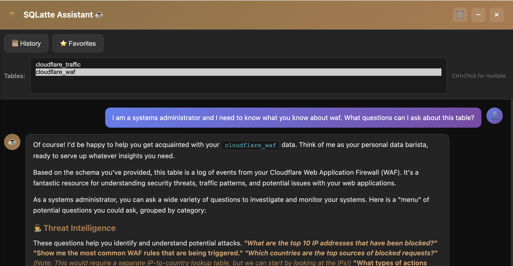
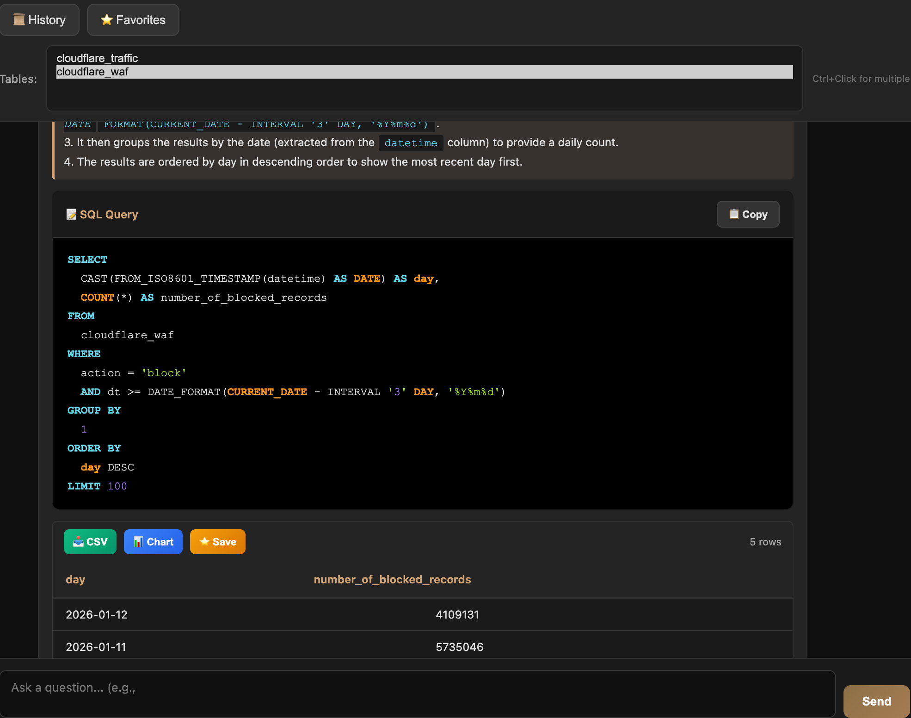
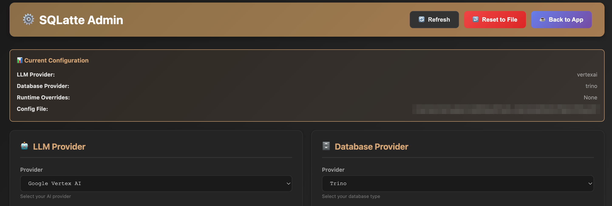
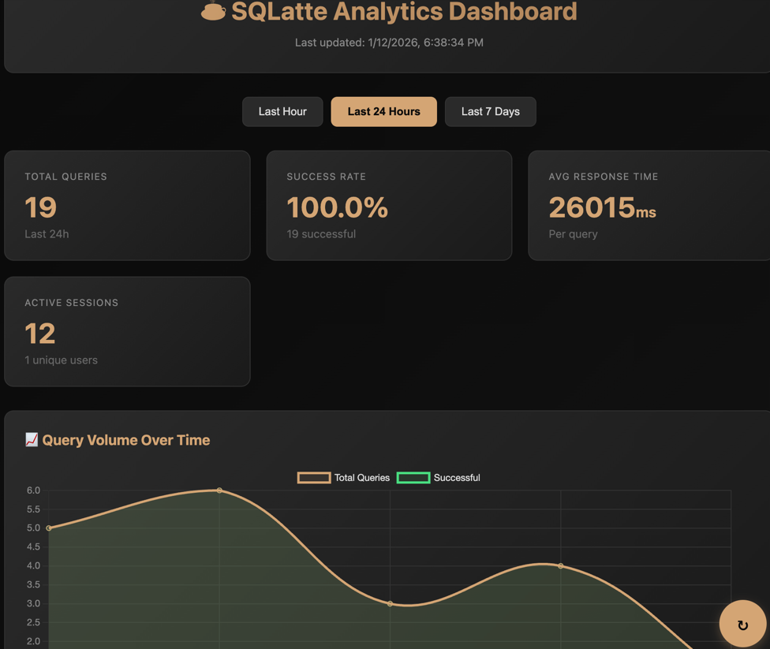

# SQLatte ☕

<p align="center">
  
</p>

<p align="center">
  <strong>AI-Powered Natural Language to SQL Converter with Conversation Memory</strong><br>
  Transform your questions into SQL queries with the power of AI - Now with conversation memory! 🧠
</p>

<p align="center">
  
  
  
  
</p>

---

##  Features


### Core Features
## ✨ Features

### Core Features
- 🤖 **AI-Powered** - Uses Anthropic Claude, Google Gemini, or Google Vertex AI
- 🗄️ **Multi-Database Support** - Trino, PostgreSQL, MySQL, and more
- 💬 **Smart Chat Interface** - Conversational AI that understands context
- 🔗 **Multi-Table JOINs** - Automatically detects and creates table relationships
- 🧠 **Conversation Memory** - Remembers chat history per session (in-memory)
- 🎯 **Context-Aware Responses** - Understands follow-up questions
- ⚙️ **Admin Panel** - Runtime configuration without restart
- ⭐ **Query History & Favorites** - Save and replay queries
- 📅 **Scheduled Queries** - Automate reports with email delivery
- 📊 **Data Visualization** - Auto-generate charts from query results
- 🔌 **Plugin System** - Extensible architecture for custom functionality
- 📈 **Analytics Dashboard** (Optional) - Query metrics and insights
- 🎨 **Embeddable Widgets** - Easy integration into any website
- ⚡ **Fast & Simple** - Single YAML config file, no complex setup
- 🐳 **Docker Ready** - Easy deployment with Docker & Docker Compose

---

##  Quick Start

### 1. Installation

```bash
# Clone the repository
git clone https://github.com/osmanuygar/sqlatte.git
cd sqlatte

# Install dependencies
pip install -r requirements.txt
```

### 2. Configuration

Edit `config/config.yaml` with your credentials:

```yaml
# LLM Configuration
llm:
  provider: "anthropic"
  anthropic:
    api_key: "sk-ant-your-key-here"  # Add your Anthropic API key
    model: "claude-sonnet-4-20250514"

# Database Configuration
database:
  provider: "trino"
  trino:
    host: "your-trino-host.com"
    port: 443
    user: "your-username"
    password: "your-password"
    catalog: "hive"
    schema: "default"
```
#### Analytics, scheduler and email  (optional - disabled by default)
```yaml
analytics:
  enabled: false  # Query history is in-memory only

scheduler:
  enabled: false  # Set to true to enable scheduled queries
  timezone: "UTC"

email:
  enabled: false  # Set to true for real emails (uses mock by default)
  smtp:
    host: "smtp.gmail.com"
    port: 587
    user: "your-email@gmail.com"
    password: "your-app-password"  # Gmail App Password
```

**Leave it at `false`** - SQLatte works perfectly without it!

---

### 3. Run

```bash
# Start the server
python run.py

# Open in browser
http://localhost:8000

# Access Admin Panel 
http://localhost:8000/admin

# Access Auth Plugin Panel 
http://localhost:8000/demo

# Access Analytics Panel 
http://localhost:8000/analytics
```

**That's it!** 🎉

<details>
<summary><b>Chat Screen</b></summary>
<p align="left">
  
</p>
</details>
<details>
<summary><b>SQL Screen</b></summary>
<p align="left">
  
</p>
</details>
<details>
<summary><b>Graphs Screen</b></summary>
<p align="left">
  
</p>
</details>
<details>
<summary><b>Admin Screen</b></summary>
<p align="left">
  
</p>
</details>
<details>
<summary><b>Analytics Screen</b></summary>
<p align="left">
  
</p>
</details>


---

## 🔌 Plugin System

SQLatte features a powerful plugin architecture that allows you to extend functionality without modifying core code.

### Available Plugins

#### 🔐 Authentication Plugin

The Authentication Plugin enables multi-tenant deployments with user-specific database connections.

**Features:**
- User login with database credentials
- Session-based authentication
- Per-user database connections
- Thread-safe connection pooling
- Session management with automatic cleanup

**Configuration:**

```yaml
# config/config.yaml
plugins:
  auth:
    enabled: true
    session_ttl_minutes: 480  # 8 hours
    max_workers: 40  # Thread pool for concurrent users

    # Database Provider Configuration (Server-side only)
    db_provider: "trino"
    db_host: "trino_hostname"
    db_port: 443

    # Catalog/Schema Restrictions
    # Empty lists = allow all, filled lists = restrict to specified
    allowed_catalogs:
      - "hive"
      - "impala"
    
    allowed_schemas:
      - "default"
      - "production"
    
    # Database Type Restrictions
    allowed_db_types:
      - "trino"
```

**Usage:**

```html
<!-- Load auth widget -->
<script src="http://localhost:8000/static/js/sqlatte-badge-auth.js"></script>

<script>
window.addEventListener('load', () => {
    window.SQLatteAuthWidget.configure({
        position: 'bottom-left',
        fullscreen: true,
        apiBase: 'http://localhost:8000'
    });
});
</script>
```
### Creating Custom Plugins

SQLatte's plugin system is built on a base plugin class that provides hooks for:
- Custom route registration
- Request/response middleware
- Authentication extension
- Database provider integration

**Example Plugin Structure:**

```python
from src.plugins.base_plugin import BasePlugin
from fastapi import FastAPI

class MyCustomPlugin(BasePlugin):
    def __init__(self, config):
        super().__init__(config)
        # Initialize your plugin
    
    def initialize(self, app: FastAPI):
        """Called on startup"""
        print("🔌 Initializing My Custom Plugin...")
    
    def register_routes(self, app: FastAPI):
        """Register custom endpoints"""
        @app.get("/my-plugin/hello")
        async def hello():
            return {"message": "Hello from my plugin!"}
    
    async def before_request(self, request):
        """Hook before each request"""
        # Add custom logic
        return None
    
    async def after_request(self, request, response):
        """Hook after each request"""
        # Modify response if needed
        return response
    
    def shutdown(self):
        """Cleanup on shutdown"""
        print("🔌 Shutting down My Custom Plugin...")
```

**Plugin Registration:**

```python
# src/api/app.py
from src.plugins.plugin_manager import plugin_manager
from my_plugin import MyCustomPlugin

# Register plugin
config = {"enabled": True, ...}
plugin = MyCustomPlugin(config)
plugin_manager.register_plugin(plugin)
```

---


## 🎨 Architecture

### Backend Flow with Memory

```
User Question
     ↓
Session Management (Get/Create Session)
     ↓
Add to Conversation History
     ↓
Get Recent Context (Last 10 messages)
     ↓
LLM Intent Detection + Context
     ↓
   ┌─────────────┬──────────────┐
   │             │              │
  SQL          Chat         Schema
   │             │              │
Generate      Generate      Fetch from DB
 Query        Response
(with context)  (with context)
   │             │
Execute       Return
   │             │
   └──────┬──────┘
          ↓
    Add Response to History
          ↓
    Return to User 
```

---

## 🐳 Docker Deployment

### Using Docker Compose (Recommended)

```bash
# 1. Edit config/config.yaml and set your credentials
vi config/config.yaml

# 2. Start with Docker Compose
docker-compose up -d

# 3. Open browser
http://localhost:8000

# 4. Access admin panel
http://localhost:8000/admin
```

### Using Dockerfile

```bash
# Build image
docker build -t sqlatte .

# Run container
docker run -d -p 8000:8000 \
  -e ANTHROPIC_API_KEY="your-key" \
  -e TRINO_HOST="your-host" \
  --name sqlatte \
  sqlatte
```

---

## 🔌 Embedding in Your Website

You can easily add the SQLatte widget to **any existing website**.

### Method 1: Serve from SQLatte Backend (Recommended)

**Easiest way!** SQLatte backend already serves the widget files:

```html
<!DOCTYPE html>
<html lang="en">
<head>
    <meta charset="UTF-8">
    <title>My Website with SQLatte</title>
</head>
<body>
    <h1>My Awesome Website</h1>
    <p>Your content here...</p>

    <!-- Load widget from SQLatte backend -->
    <script src="http://YOUR-SQLATTE-SERVER:8000/static/js/sqlatte-badge.js"></script>
    
    <!-- Configure (optional) -->
    <script>
        window.addEventListener('load', () => {
            window.SQLatteWidget.configure({
                fullscreen: true,
                apiBase: 'http://YOUR-SQLATTE-SERVER:8000'
            });
        });
    </script>
</body>
</html>
```

### Method 2: Auth Widget (User-Specific DB Connections)

```html
<!DOCTYPE html>
<html>
<body>
    <h1>My SaaS Application</h1>
    
    <!-- Load auth widget -->
    <script src="http://YOUR-SQLATTE-SERVER:8000/static/js/sqlatte-badge-auth.js"></script>
    
    <!-- Configure -->
    <script>
        window.addEventListener('load', () => {
            window.SQLatteAuthWidget.configure({
                fullscreen: true,
                position: 'bottom-left',
                apiBase: 'http://YOUR-SQLATTE-SERVER:8000'
            });
        });
    </script>
</body>
</html>
```


#### CORS Configuration

If your website and SQLatte are on **different domains**, configure CORS in `config/config.yaml`:

```yaml
cors:
  allow_origins: 
    - "https://your-website.com"
    - "http://192.168.1.50"
  allow_credentials: true
  allow_methods: ["*"]
  allow_headers: ["*"]
```

---

## ⚙️ Widget Configuration

Customize the widget behavior:

```javascript
window.SQLatteWidget.configure({
    // Position of the badge button
    position: 'bottom-right',  // 'bottom-right', 'bottom-left', 'top-right', 'top-left'
    
    // Open modal in fullscreen
    fullscreen: true,          // true = fullscreen, false = floating modal
    
    // Modal title
    title: 'SQLatte Assistant ☕',
    
    // Input placeholder text
    placeholder: 'Ask a question...',
    
    // API base URL (SQLatte backend)
    apiBase: 'http://your-backend:8000',
    
    // Delay before showing badge (milliseconds)
    autoShowDelay: 1000,
    
    // Open widget automatically on page load
    openByDefault: false
});
```

### Programmatic Control

```javascript
// Open the widget
window.SQLatteWidget.open();

// Close the widget
window.SQLatteWidget.close();

// Toggle widget
window.SQLatteWidget.toggle();

// Clear conversation history
window.SQLatteWidget.clearChat();

// Get current session ID
const sessionId = window.SQLatteWidget.getSessionId();

// Copy SQL to clipboard (NEW!)
window.SQLatteWidget.copySQL('sql-element-id');
```

### Auth Widget API

```javascript
// Authentication
window.SQLatteAuthWidget.handleLogin(credentials);
window.SQLatteAuthWidget.logout();

// Modal Controls
window.SQLatteAuthWidget.closeLoginModal();
window.SQLatteAuthWidget.closeChatModal();

// Query Operations
window.SQLatteAuthWidget.sendMessage(question);
window.SQLatteAuthWidget.handleTableChange();

// Configuration
window.SQLatteAuthWidget.configure({
    position: 'bottom-left',
    fullscreen: true,
    apiBase: 'http://your-backend:8000',
    storageKey: 'sqlatte_auth_session'
});

// Get Config
const config = window.SQLatteAuthWidget.getConfig();
```
---

## 🗄️ Supported Databases

### Currently Supported
- ✅ **Trino** - Distributed SQL engine
- ✅ **PostgreSQL** - Advanced relational database
- ✅ **MySQL** - Popular relational database

### Configuration Examples

<details>
<summary><b>Trino Configuration</b></summary>

```yaml
database:
  provider: "trino"
  trino:
    host: "trino.example.com"
    port: 443
    user: "username"
    password: "password"
    catalog: "hive"
    schema: "default"
    http_scheme: "https"
```
</details>

<details>
<summary><b>PostgreSQL Configuration</b></summary>

```yaml
database:
  provider: "postgresql"
  postgresql:
    host: "localhost"
    port: 5432
    database: "mydatabase"
    user: "postgres"
    password: "password"
    schema: "public"
```
</details>

<details>
<summary><b>MySQL Configuration</b></summary>

```yaml
database:
  provider: "mysql"
  mysql:
    host: "localhost"
    port: 3306
    database: "mydatabase"
    user: "root"
    password: "password"
```
</details>

---

## 🤖 Supported LLM Providers

### Currently Supported
- ✅ **Anthropic Claude** - Most advanced (recommended)
- ✅ **Google Gemini** - Free tier available
- ✅ **Google Vertex AI** - Enterprise GCP solution

### Configuration Examples

<details>
<summary><b>Anthropic Claude</b></summary>

```yaml
llm:
  provider: "anthropic"
  anthropic:
    api_key: "sk-ant-your-key-here"
    model: "claude-sonnet-4-20250514"
    max_tokens: 1000
```
</details>

<details>
<summary><b>Google Gemini</b></summary>

```yaml
llm:
  provider: "gemini"
  gemini:
    api_key: "your-gemini-key"
    model: "gemini-pro"
    max_tokens: 1000
```
</details>

<details>
<summary><b>Google Vertex AI</b></summary>

```yaml
llm:
  provider: "vertexai"
  vertexai:
    project_id: "my-gcp-project"
    location: "us-central1"
    model: "gemini-pro"
    credentials_path: "/path/to/service-account.json"
```
</details>

---
## 🤝 Contributing

Contributions are welcome! Please feel free to submit a Pull Request.

1. Fork the repository
2. Create your feature branch (`git checkout -b feature/AmazingFeature`)
3. Commit your changes (`git commit -m 'Add some AmazingFeature'`)
4. Push to the branch (`git push origin feature/AmazingFeature`)
5. Open a Pull Request
---

## 📄 License

This project is licensed under the MIT License - see the [LICENSE](LICENSE) file for details.

---

## 📧 Contact

- **GitHub:** [@osmanuygar](https://github.com/osmanuygar)
- **Project Link:** [https://github.com/osmanuygar/sqlatte](https://github.com/osmanuygar/sqlatte)

---

<p align="center">
  <strong>Made with ❤️ and ☕</strong><br>
  <sub>Transform your data queries with the power of AI, conversation memory, and beautiful syntax highlighting</sub>
</p>

---